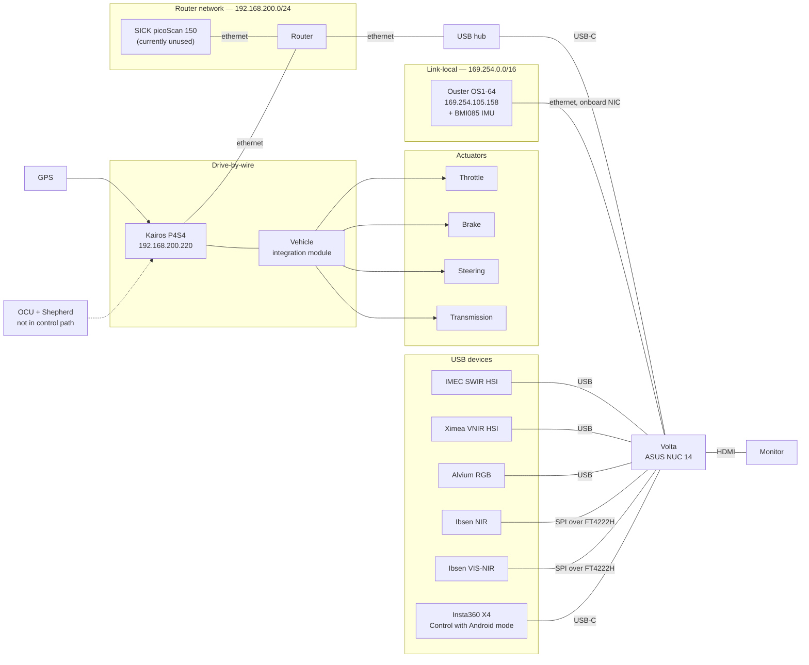
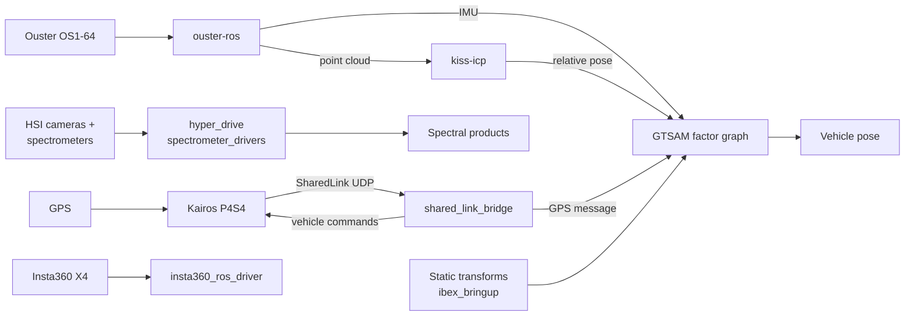

# Subsystems

Start here before reading any individual subsystem page. The diagrams below are the mental
model everything else hangs on.

Three views of the same vehicle, kept separate on purpose:

| View | Where |
| --- | --- |
| **What connects to what** — interfaces and network segments | This page |
| **What processes what** — packages and data products | This page |
| **What powers what** — rails, converters, distribution | [power/](power/) |

## Interconnect

Every data path on IBEX. Power is deliberately absent — see [power/](power/).

### How to read it

**Two network segments carry sensor and control traffic, and Volta is on both.** The
Ouster is direct-attached to Volta's onboard ethernet port on a link-local address.
Everything else on ethernet — the P4S4 and the SICK — reaches Volta through the router,
and the router connects via a USB hub over USB-C, because the onboard port is already
taken by the Ouster.

Volta's interfaces as configured:

| Interface | Address | Carries |
| --- | --- | --- |
| `enp46s0` | 169.254.223.140/16 | Ouster, direct attached |
| `enxc8a362bd9823` | 192.168.200.199/24 | Router network — P4S4 and SICK |
| `wlo1` | 192.168.0.107/24 | Wireless association with the upstream router |

The IBEX router's WAN port is fed by ethernet from a second router, which is what provides
internet to everything on `192.168.200.0/24`. Volta's `wlo1` is separately associated with
that same upstream router over wireless, so **Volta is dual-homed to the same network by
two different paths** — NAT'd through the IBEX router on the wired side, and directly on
`192.168.0.0/24` over wireless.

> TODO(verify): decide whether `wlo1` should be on at all. Volta already has internet
> through the IBEX router's WAN, so the wireless association is redundant, and it has two
> side effects worth closing: the default route may prefer wireless and bypass the IBEX
> router, and ROS 2 discovery is unauthenticated multicast on every interface it can see —
> meaning anything else on `192.168.0.0/24` can discover and publish to IBEX's topics,
> including the ones that command the vehicle. If wireless is needed, restrict DDS to the
> wired interfaces instead, and test any DDS change against the Alvium, which is why the
> stack uses FastRTPS rather than CycloneDDS.

> TODO(verify): run `ip route` and record which interface holds the default route.

The onboard port was chosen for the Ouster deliberately: it outperforms the USB adapter
for the OS1's packet volume. Do not swap them. Full addressing is in
[network.md](../05-reference/network.md).

**Volta commands the P4S4 over UDP.** `shared_link_bridge` runs on Volta and speaks the
SharedLink protocol to the P4S4 across the router network. The vendor's Shepherd
application on the OCU is not in the current control path — shown dashed above.

**The VIM sits between the P4S4 and the actuators.** Nothing reaches the throttle, brake,
steering, or transmission without passing through it, which is why it is the only place
actuator motion can be stopped. See [estop-chain.md](../01-safety/estop-chain.md).

**The GPS is on the P4S4, not on Volta.** Its data arrives with the SharedLink messages.

**Two USB devices are not what they look like.** The Ibsen spectrometers present as USB
but speak SPI through an FTDI FT4222H bridge. The Insta360 has its own battery and is
driven over USB-C in Control with Android mode rather than being a normal camera device.

## Processing pipeline

What consumes what, at package level. Topic names and rates are in
[ros-graph.md](../05-reference/ros-graph.md).

The GTSAM factor graph lives in **`ibex_state`**, as `graph_frontender.py` with its
estimator code under `ibex_state/estimator/` — `factors.py` and `symbols.py` are the
GTSAM-facing parts. Configuration is in `config/graph_frontender_config.yaml`.

> TODO(verify): confirm whether the Ouster's BMI085 IMU feeds the graph directly or is
> preintegrated first, and whether anything currently consumes the spectral products
> beyond recording them.

## Subsystems and packages

The two do not map one-to-one, which is why this manual is central rather than a set of
per-package READMEs.

| Subsystem | Packages | Hardware |
| --- | --- | --- |
| [Motion](motion/) | `shared_link_bridge` | P4S4, VIM, actuators, OCU |
| [Perception](perception/) | `hyper_drive`, `hyper_drive_interfaces`, `spectrometer_drivers`, `spectrometer_interfaces`, `insta360_ros_driver`, `ouster-ros` | Ouster, SICK, IMEC SWIR, Ximea VNIR, Alvium RGB, Ibsen ×2, Insta360 |
| [State estimation](state-estimation/) | `ibex_state`, `kiss-icp` | None of its own |
| [Power](power/) | None | Batteries, converters, Kairos box, Compute and Sensing box |
| [Learning](learning/) | None | None — not yet implemented |
| [Simulation](simulation/) | None | None — not yet implemented |

`ibex_bringup` belongs to no subsystem. It is cross-cutting and is documented in
[launch-files.md](../05-reference/launch-files.md).

Three subsystems have no code at all. Two have no hardware. Perception spans six packages
and eight sensors.

## Open items

| Item | Blocks |
| --- | --- |
| Whether `wlo1` should be enabled, and which interface holds the default route | [network.md](../05-reference/network.md) |
| Whether the SICK is ever brought up | Perception hardware page |
| Loaded weight and as-built height of the vehicle | [transport.md](../02-operations/transport.md) |

## Related

- [power/](power/) — the power distribution diagram
- [network.md](../05-reference/network.md) — addresses and interfaces
- [tf-frames.md](../05-reference/tf-frames.md) — the frame tree
- [ros-graph.md](../05-reference/ros-graph.md) — topics and rates
- [estop-chain.md](../01-safety/estop-chain.md) — where motion can be stopped
